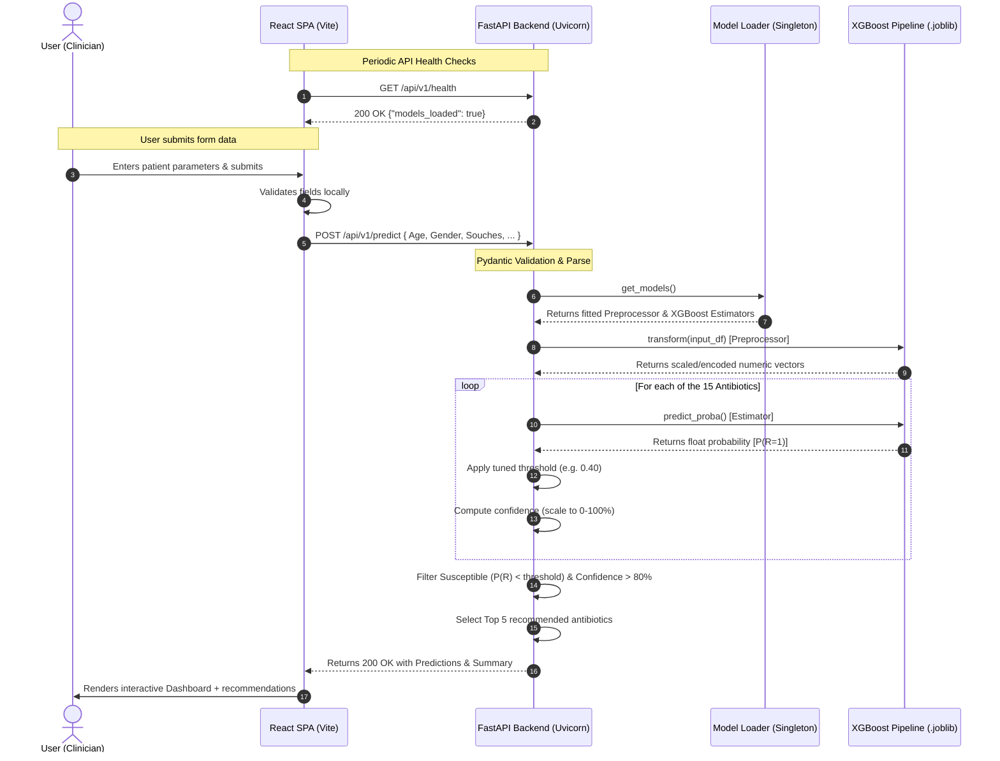
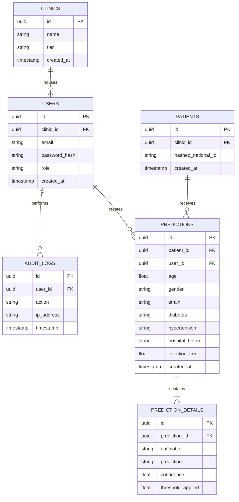
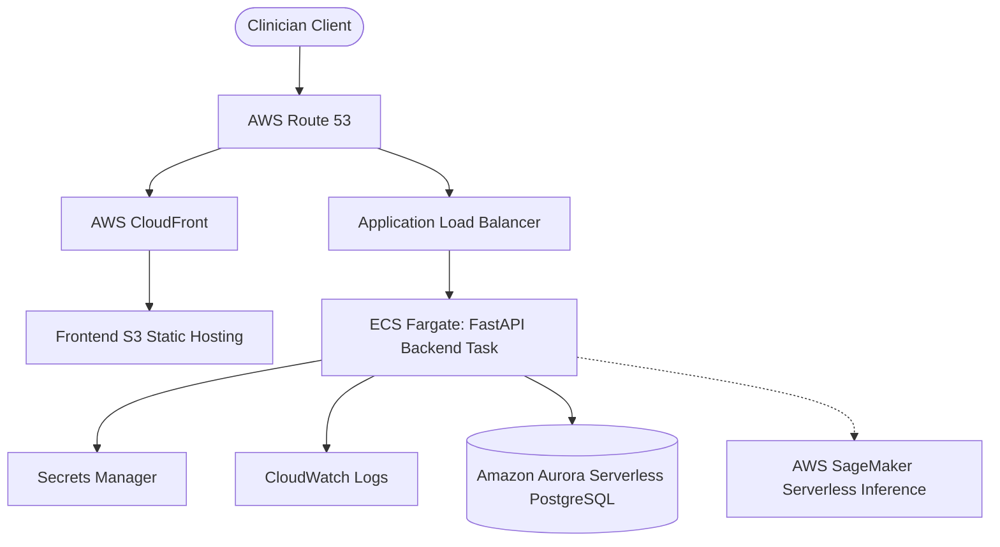
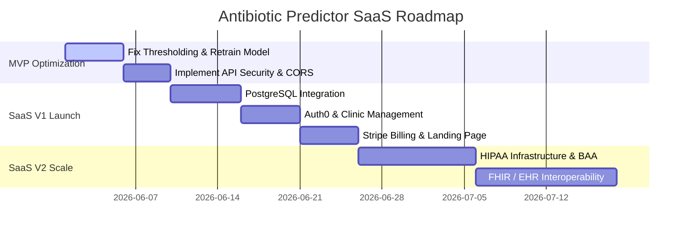

# Antibiotic Resistance Predictor - Project Context

## 1. Project Overview

### What problem does this project solve?
Selecting the right antibiotic for bacterial infections is a race against time. The gold standard for identifying antibiotic resistance is a laboratory-based **antibiogram culture test**, which takes **48 to 72 hours**. During this critical window, clinicians must prescribe **empirical treatments** (educated guesses). 

If the guess is wrong (e.g., the pathogen is resistant to the chosen drug), treatment fails, patient outcomes worsen, and antibiotic resistance spreads.

This project solves this bottleneck by providing a **machine learning-based clinical decision support system**. It consumes standard patient demographics, comorbidities, and basic pathogen strain data to **instantly predict the susceptibility or resistance profile** of a pathogen across **15 critical antibiotics**.

### Target users
* **Clinicians & Physicians**: For choosing the most effective targeted empirical therapy instantly.
* **Clinical Microbiologists**: To cross-reference predicted resistance profiles with laboratory tests.
* **Hospital Administrators**: To monitor resistance trends and optimize institutional antibiotic formulary usage.
* **Healthcare Researchers**: For analyzing resistance patterns and model effectiveness across demographic classes.

### Current project status
* **Maturity**: Functional MVP (Minimum Viable Product).
* **Architecture**: A containerized two-tier application containing a **FastAPI backend** and a **React (Vite) frontend**.
* **ML Integration**: The system loads a pre-trained **XGBoost Multi-Output Classifier** serialized as a `joblib` file.
* **Limitations**: Highly variable accuracy across antibiotics. While predictions are highly stable for beta-lactams due to abundant positive labels, they collapse for minority (low baseline resistance) antibiotics due to a threshold tuning flaw in the training script.
* **Security & Persistence**: No database, no user management, no encryption, and no compliance controls are currently implemented.

### Main value proposition
* **Instant Risk Mitigation**: Yields resistance profiles within milliseconds, bypassing the 3-day diagnostic delay.
* **Recall-First Safety Thresholds**: Calibrated to minimize False Negatives (missing resistance), ensuring patients are not placed on ineffective drugs.
* **Zero Infrastructure Overhead**: Low-latency, CPU-friendly inference requiring no heavy GPU hosting, packaged inside lightweight Docker containers.

---

## 2. Tech Stack

### Frontend
* **Framework**: React.js (v18.2) initialized via **Vite** for optimized assets and hot-module replacement.
* **Libraries**: 
  * `Axios` (v1.6.2): Handles asynchronous API communication, timeout management, and error handling.
  * Tailwind CSS (v3.3): Utility-first styling framework used to build custom responsive light/dark components.
* **State management**: 
  * Component-level local state utilizing React's `useState` hook.
  * Side effects (such as API health polls and initialization tasks) orchestrated via `useEffect`.
* **UI components**: Custom modular components:
  * `PredictionForm.jsx`: Consumes patient data with validation inputs.
  * `ResultsTable.jsx`: Shows color-coded prediction labels with confidence meters.
  * `SummaryCard.jsx`: Provides key analytics and top susceptible recommendations.
  * Alert elements (`ErrorAlert.jsx`, `SuccessAlert.jsx`) and status wrappers (`LoadingSpinner.jsx`).

### Backend
* **Framework**: FastAPI (v0.104.1) for high-performance, asynchronous REST API delivery.
* **APIs**: Fully structured HTTP endpoints featuring auto-generated Interactive Swagger Docs (`/docs`) and ReDoc (`/redoc`).
* **Authentication**: **None**. There is currently no API key, OAuth2, JWT, or IP whitelist implementation.
* **Server**: Uvicorn (v0.24.0) serving FastAPI, backed by Gunicorn (v21.2) capability for production processes.

### Database
* **Database type**: **None**.
* **Schema overview**: The application runs completely stateless. Input features are processed on-the-fly and discarded, while predictions are sent directly to the client without persistent logging or audit trails.

### Machine Learning
* **Model type**: Multi-label classifier wrapping independent estimators for each target label.
* **Algorithms**: **XGBoost Classifier** (`XGBClassifier`, v1.7.6) grouped under scikit-learn's `MultiOutputClassifier`.
* **Training pipeline**:
  1. **Harmonization**: Antibiogram labels cleaned into binary: `R` / `r` → `1` (Resistant), `S` / `s` → `0` (Susceptible). Discards intermediate and missing values.
  2. **Split**: 70% train | 15% validation | 15% test.
  3. **Preprocessing**: Numeric features imputed with median and scaled via `StandardScaler`. Categorical features imputed with majority mode and encoded via `OneHotEncoder`.
  4. **Threshold Tuning**: validation probabilities evaluated from `[0.10, 0.90]` targeting $F_1 \ge 0.40$ to optimize Recall.
  5. **Serialization**: The pipeline's fitted `ColumnTransformer`, `MultiOutputClassifier`, and tuned thresholds are saved into a single `model_small.joblib` artifact.
* **Feature engineering**: Basic automated pre-processing. No feature interaction terms, target encoding, or binning are currently implemented.

### Cloud & DevOps
* **Hosting**: Currently configured for local developer setups or self-hosted virtual machines.
* **CI/CD**: None configured.
* **Infrastructure**: 
  * Dockerization supported via custom `Dockerfiles` for both Frontend and Backend.
  * Orchestration managed locally via `docker-compose.yml` linking the React client to the FastAPI server.
  * `Procfile` and `runtime.txt` are included at the backend root for Heroku compatibility.

---

## 3. Folder Structure

Below is the repository structure:

```
.
├── Backend/                            # FastAPI Application
│   ├── logs/                           # Auto-generated application logs
│   │   └── app.log                     # Standard server logs
│   ├── outputs/                        # Metrics exported during model training
│   │   ├── overall_metrics.csv         # Overall macro, weighted F1, and Hamming loss
│   │   ├── per_label_metrics.csv       # Per-antibiotic thresholds and accuracy scores
│   │   └── tuned_thresholds.csv        # Extracted threshold rates
│   ├── antibiotic_resistance_ml.py     # Source ML training script
│   ├── cleaned_output.csv              # Underlying patient dataset (10,710 records)
│   ├── config.py                       # Environment and CORS settings
│   ├── Dockerfile                      # Backend container configuration
│   ├── exceptions.py                   # Custom error classes (ModelNotLoaded, etc.)
│   ├── logger_config.py                # Logger configuration with rotating file handlers
│   ├── main.py                         # REST Endpoints and middleware declarations
│   ├── model_loader.py                 # Singleton caching model-loading logic
│   ├── model_small.joblib              # Serialized XGBoost model pipeline
│   ├── Procfile                        # Heroku deployment instructions
│   ├── requirements.txt                # Python backend dependencies
│   ├── runtime.txt                     # Target python environment (python-3.10.12)
│   ├── schemas.py                      # Pydantic request/response validation schemas
│   ├── test.py                         # Mock request validation script
│   └── utils.py                        # Preprocessing and XGBoost evaluation engine
│
├── Frontend/                           # React Vite Application
│   ├── src/
│   │   ├── components/                 # React UI elements
│   │   │   ├── ErrorAlert.jsx          # Red error bubble
│   │   │   ├── LoadingSpinner.jsx      # Loading animation
│   │   │   ├── PredictionForm.jsx      # 7-field patient input form
│   │   │   ├── ResultsTable.jsx        # Detailed prediction output display
│   │   │   ├── SuccessAlert.jsx        # Green success bubble
│   │   │   └── SummaryCard.jsx         # High-level analytics and drug recommendations
│   │   ├── App.jsx                     # Core state management and layout
│   │   ├── index.css                   # Custom global directives (Tailwind directives)
│   │   └── main.jsx                    # React entrypoint mounting App.jsx
│   ├── Dockerfile                      # Frontend container configuration
│   ├── package.json                    # Node dependencies and scripts
│   ├── tailwind.config.js              # Tailwind utility layout settings
│   └── vite.config.js                  # Vite server proxy configurations
│
├── screenshots/                        # Documentation images
│   ├── ui-form.png
│   └── ui-result.png
│
├── docker-compose.yml                  # Local development container composer
└── README.md                           # Quickstart guide
```

### Purpose of major folders:
* `/Backend`: Handles client requests, parses incoming data using Pydantic, applies the saved scikit-learn/XGBoost pipeline, runs inference, compiles recommendation statistics, and serves them. Also contains the training pipeline scripts and metrics.
* `/Frontend`: Contains the interactive Single Page Application (SPA). It renders forms, validates inputs, queries the API, and displays results using clean, responsive dashboards.
* `/Model` (or training source inside Backend): Houses `antibiotic_resistance_ml.py`, where data processing, training, and threshold calibrations occur.

---

## 4. System Architecture

### Operational Flow Diagram



### Component Details
1. **User Flow**: A clinician accesses the dashboard, fills out seven parameters (Age, Gender, bacterial strain `Souches`, comorbidities, and hospital history), and submits. They instantly receive a visual summary showing the total resistant/susceptible count, drug safety alerts, and a sorted results table.
2. **Data Flow**: Unprocessed client inputs are serialized to JSON, passed over HTTP, and validated by Pydantic. Validated inputs are mapped into a single-row Pandas DataFrame and fed to the `ColumnTransformer`.
3. **Prediction Flow**: The numeric outputs of the preprocessor are submitted to the 15 underlying XGBoost classifiers. Each model produces a probability score. If the probability exceeds the respective tuned threshold, the drug is flagged as `"Resistant"`.
4. **API Interactions**: The frontend maintains a real-time status banner reflecting the `/api/v1/health` heartbeat. Standard operations consume `/api/v1/predict`, and metadata queries pull from `/api/v1/info`.
5. **ML Inference Workflow**: Inference runs purely in-memory using CPU threads. The fitted pipeline is cached as a singleton to avoid expensive disk reads on subsequent requests.

---

## 5. Dataset Analysis

* **Dataset source**: File [cleaned_output.csv](file:///c:/Users/yashc/Desktop/Github/Antibiotic-Resistance-Predictor/Backend/cleaned_output.csv) located inside `/Backend`. The original clinical repository source details are not explicitly declared (treated as historical clinical antibiograms).
* **Number of samples**: **10,710 patient records** raw. After cleaning and removing rows where all antibiotic targets are empty, the dataset contains **10,710 samples** (every row had at least one valid target).
* **Features** (7 variables):
  1. `Age` (Numerical): Age in years.
  2. `Gender` (Categorical): `"M"` (Male) or `"F"` (Female).
  3. `Souches` (Categorical): Bacterial strain (e.g., *Escherichia coli*, *Klebsiella pneumoniae*).
  4. `Diabetes` (Categorical): `"Yes"` or `"No"`.
  5. `Hypertension` (Categorical): `"Yes"` or `"No"`.
  6. `Hospital_before` (Categorical): `"Yes"` or `"No"` (indicating prior hospitalization).
  7. `Infection_Freq` (Numerical): Number of prior infections.
* **Target variables** (15 binary outputs representing resistance to antibiotics):
  1. `AMX/AMP` (Amoxicillin/Ampicillin)
  2. `AMC` (Amoxicillin/Clavulanic Acid)
  3. `CZ` (Cefazolin)
  4. `FOX` (Cefoxitin)
  5. `CTX/CRO` (Cefotaxime/Ceftriaxone)
  6. `IPM` (Imipenem)
  7. `GEN` (Gentamicin)
  8. `AN` (Amikacin)
  9. `Acide nalidixique` (Nalidixic Acid)
  10. `ofx` (Ofloxacin)
  11. `CIP` (Ciprofloxacin)
  12. `C` (Chloramphenicol)
  13. `Co-trimoxazole` (Trimethoprim/Sulfamethoxazole)
  14. `Furanes` (Nitrofurantoin)
  15. `colistine` (Colistin)
* **Data preprocessing steps**:
  * **Numerical features**: Imputed with median and scaled using `StandardScaler`.
  * **Categorical features**: Imputed with mode (`"most_frequent"`) and converted to dense numeric columns using `OneHotEncoder(handle_unknown="ignore")`.
* **Missing value handling**:
  * Features with `NaN`, `?`, or `"missing"` values are handled inside the pipeline step using `SimpleImputer`.
  * Target antibiogram values containing `NaN` are imputed using the **majority class (mode)** of that specific antibiotic column to maintain a complete target matrix during training.
* **Class balancing methods**:
  * No synthetic oversampling (SMOTE) or undersampling was applied to the underlying data.
  * In the training configurations of Logistic Regression, Random Forest, and Calibrated SVM, `class_weight="balanced"` was enabled. However, **XGBoost Classifier did not employ class balancing weights** during training, contributing to its poor performance on imbalanced minority labels.

---

## 6. Machine Learning Details

### Model used
The system utilizes a **Multi-Output XGBoost Classifier** wrapped inside `MultiOutputClassifier`.

### Why it was selected
In the overall model validation phase on the test set, **XGBoost** and **SVM (Calibrated)** achieved the lowest **Hamming Loss (~0.229)**, making them the most accurate overall label predictors compared to Logistic Regression (~0.425) and Random Forest (~0.334). However, as explained below, this overall metric masks severe performance failures on minority labels.

### Training process
* **Split ratio**: 70% Train (7,422 samples), 15% Validation (1,591 samples), 15% Test (1,607 samples).
* **Tuning**: Multi-label threshold sweep `[0.10 to 0.90]` on the validation set.
* **Tuning Optimization Goal**: The tuning script attempted to optimize thresholds to maximize **F1-score**, setting a hard floor constraint of $F_1 \ge 0.40$.

### Evaluation metrics & Brutal Performance Analysis
For the **highly prevalent Beta-lactams** (which exhibit ~59% baseline resistance in the dataset), the model performs well:
* **Precision**: ~0.63 to ~0.71
* **Recall**: ~0.81 to ~0.91
* **F1-score**: ~0.74 to ~0.76
* **ROC-AUC**: ~0.64 to ~0.68

For the **low prevalence antibiotics** (fluoroquinolones, aminoglycosides, etc. with ~14% baseline resistance), the model **completely fails**:
* **The Threshold Flaw**: Because baseline resistance is so low, no threshold in the grid search `[0.10, 0.90]` could achieve the required $F_1 \ge 0.40$ floor.
* **The Consequences**: The script defaulted their thresholds to **0.50**. At a 0.50 threshold, since the model's predicted probability for these rare classes almost never reaches 50%, **the models predict "Susceptible" (0) for 100% of samples**.
* **The Metrics (XGBoost & SVM)**:
  * **Gentamicin (GEN)**: Precision = **0.556**, Recall = **0.037**, F1 = **0.070**
  * **Amikacin (AN)**: Precision = **0.364**, Recall = **0.013**, F1 = **0.024**
  * **Nalidixic Acid (Acide nalidixique)**: Precision = **0.000**, Recall = **0.000**, F1 = **0.000**
  * **Chloramphenicol (C)**: Precision = **0.000**, Recall = **0.000**, F1 = **0.000**
  * **Colistin (colistine)**: Precision = **0.000**, Recall = **0.000**, F1 = **0.000**
  * **Ofloxacin (ofx)**: Precision = **1.000**, Recall = **0.005**, F1 = **0.011**

This means the current model **cannot predict resistance for 9 out of 15 antibiotics**. It will predict "Susceptible" for these drugs regardless of the input data, posing a severe clinical safety risk if used in production.

---

## 7. Current Features

| Feature | Description | Status | Files Involved |
| :--- | :--- | :--- | :--- |
| **Demographic Form** | Capture patient demographics (Age, Gender) and clinical parameters (Diabetes, Hypertension, Souches, etc.). | **Complete** | [PredictionForm.jsx](file:///c:/Users/yashc/Desktop/Github/Antibiotic-Resistance-Predictor/Frontend/src/components/PredictionForm.jsx) |
| **Real-time Prediction Engine** | REST endpoint executing preprocessing pipeline, inference, and mapping thresholds. | **Complete** | [main.py](file:///c:/Users/yashc/Desktop/Github/Antibiotic-Resistance-Predictor/Backend/main.py), [utils.py](file:///c:/Users/yashc/Desktop/Github/Antibiotic-Resistance-Predictor/Backend/utils.py) |
| **Interactive Results Dashboard** | Displays color-coded results tables with active confidence metrics and responsive styles. | **Complete** | [ResultsTable.jsx](file:///c:/Users/yashc/Desktop/Github/Antibiotic-Resistance-Predictor/Frontend/src/components/ResultsTable.jsx), [App.jsx](file:///c:/Users/yashc/Desktop/Github/Antibiotic-Resistance-Predictor/Frontend/src/App.jsx) |
| **Therapy Recommendations** | Generates a list of the top 5 recommended antibiotics based on high confidence of susceptibility. | **Complete** | [SummaryCard.jsx](file:///c:/Users/yashc/Desktop/Github/Antibiotic-Resistance-Predictor/Frontend/src/components/SummaryCard.jsx), [main.py](file:///c:/Users/yashc/Desktop/Github/Antibiotic-Resistance-Predictor/Backend/main.py) |
| **Heartbeat Health Checker** | Automatically checks connection status and ensures the model is loaded in memory. | **Complete** | [model_loader.py](file:///c:/Users/yashc/Desktop/Github/Antibiotic-Resistance-Predictor/Backend/model_loader.py), [App.jsx](file:///c:/Users/yashc/Desktop/Github/Antibiotic-Resistance-Predictor/Frontend/src/App.jsx) |
| **Result Downloader** | Click-to-download button to export generated predictions, patient info, and metrics as a local JSON file. | **Complete** | [App.jsx](file:///c:/Users/yashc/Desktop/Github/Antibiotic-Resistance-Predictor/Frontend/src/App.jsx) |
| **Dark Theme Toggle** | Responsive dark-mode styling across all interface cards and tables. | **Complete** | [App.jsx](file:///c:/Users/yashc/Desktop/Github/Antibiotic-Resistance-Predictor/Frontend/src/App.jsx) |

---

## 8. API Documentation

### Endpoints

#### 1. GET `/`
* **Description**: Simple API service health check.
* **Authentication**: None.
* **Response Format (JSON)**:
```json
{
  "message": "Antibiotic Resistance Prediction API",
  "status": "running",
  "version": "1.0.0"
}
```

#### 2. GET `/api/v1/health`
* **Description**: Verifies API status and confirms if the machine learning model has loaded into memory.
* **Authentication**: None.
* **Response Format (JSON)**:
```json
{
  "status": "healthy",
  "models_loaded": true,
  "environment": "development",
  "version": "1.0.0",
  "message": "All systems operational"
}
```

#### 3. GET `/api/v1/info`
* **Description**: Returns metadata regarding active models, supported target antibiotics, validated fields, and available paths.
* **Authentication**: None.
* **Response Format (JSON)**:
```json
{
  "api_name": "Antibiotic Resistance Prediction API",
  "version": "1.0.0",
  "environment": "development",
  "models": ["XGBoost (Multi-Output)"],
  "antibiotics": ["AMX/AMP", "AMC", "CZ", "FOX", "CTX/CRO", "IPM", "GEN", "AN", "Acide nalidixique", "ofx", "CIP", "C", "Co-trimoxazole", "Furanes", "colistine"],
  "input_fields": {
    "Age": "float (0-150 years)",
    "Gender": "string (M or F)",
    "Souches": "string (bacterial strain)",
    "Diabetes": "string (Yes or No)",
    "Hypertension": "string (Yes or No)",
    "Hospital_before": "string (Yes or No)",
    "Infection_Freq": "float (≥ 0)"
  },
  "endpoints": {
    "health": "/api/v1/health",
    "predict": "/api/v1/predict",
    "info": "/api/v1/info",
    "docs": "/docs",
    "redoc": "/redoc"
  }
}
```

#### 4. POST `/api/v1/predict`
* **Description**: Evaluates patient input data against the multi-output XGBoost pipeline and returns resistance predictions.
* **Authentication**: None.
* **Request Body (JSON)**:
```json
{
  "Age": 55,
  "Gender": "F",
  "Souches": "Escherichia coli",
  "Diabetes": "Yes",
  "Hypertension": "No",
  "Hospital_before": "Yes",
  "Infection_Freq": 2
}
```
* **Response Body (JSON)**:
```json
{
  "status": "success",
  "data": [
    {
      "antibiotic": "AMX/AMP",
      "prediction": "Resistant",
      "confidence": 89.3
    },
    {
      "antibiotic": "GEN",
      "prediction": "Susceptible",
      "confidence": 96.3
    }
  ],
  "summary": {
    "total_antibiotics": 15,
    "resistant_count": 6,
    "susceptible_count": 9,
    "resistant_percentage": 40.0,
    "susceptible_percentage": 60.0,
    "high_confidence_resistant": ["AMX/AMP", "AMC"],
    "high_confidence_susceptible": ["GEN", "AN"],
    "recommended_antibiotics": ["GEN", "AN"]
  },
  "timestamp": "2026-05-29T18:46:16.852Z"
}
```

---

## 9. Database Documentation

> [!WARNING]
> **No Database Implemented.**
> The current system has no persistent database layers, schemas, constraints, indexes, or relationships.

### Proposed Database Schema (For SaaS / Production)
To transition to a production-ready SaaS, the following schema is recommended:



---

## 10. Security Analysis

### Existing security measures
* **Input Validation**: Pydantic schemas enforce type correctness, age ranges ($0-150$), and strict values for category fields (e.g. `Gender` must be `"M"` or `"F"`).
* **CORS Limits**: Enabled via FastAPI middleware, with acceptable URLs controlled through backend environment parameters.

### Vulnerabilities & Missing Controls
1. **Lack of Authentication/Authorization**: The `/api/v1/predict` endpoint has no access control. Anyone with network access can query the server, presenting a vector for abuse or denial of service.
2. **Lack of Encryption**: In transit, HTTP is used by default instead of HTTPS. There is no column-level encryption or hashing for patient identifiers.
3. **Data Privacy & Compliance**: 
   * **HIPAA / GDPR Violation**: The API accepts and processes raw demographic data without tokenization or anonymization.
   * **Lack of Audit Logs**: There is no immutable ledger tracking who requested predictions, when they requested them, or what data was sent, which is a requirement for clinical auditing.
4. **Model Safety Disclaimer**: Present only as text in the frontend footer, without hard rails in the API response or signed validation proofs, leaving the hospital exposed to liability.

---

## 11. Deployment Analysis

### Current deployment process
* The system is deployed locally or to virtual machines using Docker and Docker Compose.
* Running `docker-compose up` builds both the frontend and backend, mapping internal ports to `5173` (Frontend) and `8000` (Backend).

### Environment variables

#### Backend (`Backend/.env`)
* `ENVIRONMENT`: Control settings (default: `development`).
* `MODEL_PATH`: Location of the serialized pipeline file (default: `model_small.joblib`).
* `FRONTEND_URL`: URL of the frontend for CORS configuration (default: `http://127.0.0.1:5173`).
* `LOG_LEVEL`: Logger verbosity level (default: `INFO`).

#### Frontend (`Frontend/.env`)
* `VITE_API_URL`: The destination URL for API requests (default: `http://localhost:8000`).

### Build process
* **Backend**: Standard Python virtual environment or Docker image using a `python:3.10-slim` base. Installs packages listed in `requirements.txt`.
* **Frontend**: Node.js ecosystem building assets through Vite (`npm run build` or local live-reloads).

### Infrastructure dependencies
* **CPU/RAM**: Lightweight. No GPU requirements. Fits comfortably on a single core, 1GB RAM instance.
* **Storage**: Under 100MB for the entire application bundle, including the 17KB model artifact.

---

## 12. AWS Migration Readiness

To deploy this system at scale on AWS, the following serverless, high-availability architecture is recommended:



### Recommended AWS Services
* **Frontend**: Static website hosting on **Amazon S3**, distributed globally via **Amazon CloudFront CDN**.
* **Backend**: Dockerized FastAPI container hosted on **AWS ECS Fargate** behind an **Application Load Balancer (ALB)** for auto-scaling.
* **Database**: **Amazon Aurora Serverless v2 (PostgreSQL)** for clinical records and user management.
* **Machine Learning**: **AWS SageMaker Serverless Inference** to host, version, and scale prediction pipelines separately from the web server.

### Cost estimates (SaaS Startup Scale)
* **ECS Fargate (2 Tasks: 0.5 vCPU, 1GB RAM)**: ~$20 / month
* **Aurora Serverless Database (0.5 to 2 ACUs)**: ~$30 / month
* **S3 + CloudFront (Frontend static assets)**: ~$5 / month
* **Application Load Balancer**: ~$16 / month
* **Total Estimated Baseline Cost**: **~$71 / month** (scales with traffic).

### Scalability considerations
Fargate tasks can scale horizontally based on CPU/Memory usage, and SageMaker handles concurrent model execution automatically.

---

## 13. SaaS Readiness Assessment

### Missing Features

```
[ ] User Authentication & Multi-Tenancy (Clinics cannot sign up or isolate their data)
[ ] Stripe Billing & Subscription Tiers (Pay-per-prediction or seat-based licenses)
[ ] Hospital Organization Controls (Admin vs. Physician vs. Nurse roles)
[ ] Clinic Analytics Dashboard (Aggregate statistics on regional resistance patterns)
[ ] Electronic Health Record (EHR) Integrations (FHIR API standard connection)
[ ] Patient History Timeline (Tracking a patient's resistance progression over time)
[ ] HIPAA-compliant Audit Logging (Tracking all data access and actions)
```

### Technical Gaps
* **Multi-tenancy**: There is no database or tenant-routing key to segregate clinical records between different hospitals.
* **HIPAA Compliance**: No data-at-rest encryption, no BAA signed infrastructure, and lack of secure anonymization proxies.
* **Monitoring & Alerts**: No integration with APM tools (e.g., Datadog, Sentry) to monitor latency, memory leaks, or prediction drift.

### Business Gaps
* **Target Customers**: High-friction enterprise sales cycles with hospital procurement departments and IT security boards.
* **Pricing opportunities**:
  * *Freemium*: 50 free predictions/month for independent clinics.
  * *Professional*: $199/month per clinic (up to 1,000 predictions).
  * *Enterprise*: Custom contract pricing for hospital networks with EHR integration.

---

## 14. Improvement Opportunities

### High Impact

#### 1. Fix the Per-Label Threshold Flaw
* **Description**: Resolve the issue where minority labels default to a 0.5 threshold and predict 0% resistance. Modify the search floor parameter or use recall-weighted cross-entropy loss during training.
* **Difficulty**: Medium.
* **Estimated Effort**: 3 days.
* **Expected Value**: Restores the model's ability to predict resistance for all 15 antibiotics, ensuring clinical safety.

#### 2. Implement Role-Based JWT Authentication
* **Description**: Secure the API using OAuth2 with JWT tokens, restricting access to verified clinical users.
* **Difficulty**: Medium.
* **Estimated Effort**: 4 days.
* **Expected Value**: Prevents unauthorized API queries and secures clinical workflows.

---

### Medium Impact

#### 1. Transition to a Relational Database (PostgreSQL)
* **Description**: Integrate SQLAlchemy or SQLModel to persist patient predictions, clinic profiles, and audit events.
* **Difficulty**: Medium.
* **Estimated Effort**: 5 days.
* **Expected Value**: Enables historical patient tracking and clinic reporting.

#### 2. Advanced Feature Engineering
* **Description**: Introduce microbiological features (e.g., Gram stain classification, specimen source) and interact numeric variables.
* **Difficulty**: Medium.
* **Estimated Effort**: 4 days.
* **Expected Value**: Improves the model's discriminative power (ROC-AUC) for highly prevalent classes.

---

### Low Impact

#### 1. Real-time Model Drift Monitoring
* **Description**: Monitor incoming clinical data distributions to detect performance drift over time.
* **Difficulty**: High.
* **Estimated Effort**: 7 days.
* **Expected Value**: Alerts ML engineers when the model needs retraining due to changing resistance patterns.

---

## 15. Complete Roadmap



* **MVP Optimization (Timeline: 2 Weeks)**: Fix the thresholding script, retrain the models, resolve minor package vulnerabilities, and add API token authorization.
* **SaaS V1 Launch (Timeline: 4 Weeks)**: Integrate PostgreSQL, Auth0 multi-tenancy, Stripe billing tiers, and launch a clinical landing page.
* **SaaS V2 Scale (Timeline: 6 Weeks)**: Obtain HIPAA compliance certifications, implement EHR interoperability using FHIR standards, and partner with regional health clinics.

---

## 16. Resume Value Assessment

### What makes this project impressive
* **High Real-World Impact**: Directly addresses antibiotic stewardship, a major global health challenge.
* **True Full-Stack Engineering**: Connects ML pipelines, containerized networks, REST APIs, and interactive UI dashboards.
* **Advanced ML Concepts**: Leverages multi-label classification, threshold tuning, and recall optimization instead of basic accuracy.

### What weakens it currently
* **The Minority Label Failure**: Zero prediction capability for 9 out of 15 antibiotics due to the threshold search floor constraint.
* **Lack of Persistence & Auth**: Feels like a sandbox project due to the absence of a database and security layers.

### Additions to stand out to recruiters
* **FHIR Integration**: Support the HL7 FHIR standard for clinical data exchange, showing familiarity with healthcare IT.
* **E2E Testing Suite**: Add Pytest for API endpoints and Cypress for frontend flows.

### Additions to make it startup-worthy
* **FHIR-compliant API Gateway** to integrate directly with hospital EHR systems (Epic/Cerner).
* **Clinical Trial Validation**: Validate model performance on a prospective cohort of real patient cases.

---

## 17. Files That Need Refactoring

### 1. File: `Backend/antibiotic_resistance_ml.py`
* **Problem**: The threshold tuning search uses a hard constraint of $F_1 \ge 0.40$. For minority labels, this constraint is never met, causing the threshold to default to `0.50` and resulting in 0% recall.
* **Suggested Solution**: 
  * Lower the F1 floor constraint to `0.10` or `0.15` for rare labels, or optimize for a cost-weighted combination of Precision and Recall.
  * Train XGBoost with class weights using `scale_pos_weight` to address class imbalance.

### 2. File: `Backend/main.py`
* **Problem**: Hardcoded CORS origins, lack of request rate-limiting, and missing authorization headers on predictions.
* **Suggested Solution**: 
  * Load CORS origins dynamically from environment variables.
  * Add a security dependency block checking JWT tokens before running inference.

### 3. File: `Frontend/src/App.jsx`
* **Problem**: Large component handling layout, state management, HTTP requests, dark-mode styling, and JSON exports in a single file.
* **Suggested Solution**: 
  * Extract API requests into a dedicated service layer (e.g., `services/api.js`).
  * Utilize React Context or clean state hooks to separate layout styling from network logic.

---

## 18. Executive Summary

### Maturity Level
* **Category**: Functional MVP / Research Prototype.

### Scores
* **Technical Quality Score**: **6 / 10** (Clean FastAPI/React setup, but contains a severe thresholding bug in the training pipeline).
* **SaaS Readiness Score**: **2 / 10** (Lacks authentication, databases, multi-tenancy, and subscription features).
* **Production Readiness Score**: **3 / 10** (Clinically unsafe to deploy due to 0% recall on minority antibiotics and lack of security/privacy controls).

### Recommended Next Steps
1. **Fix the Threshold Bug**: Lower the F1 threshold floor in the training script and retrain the model to restore predictions for minority antibiotics.
2. **Implement JWT Security**: Secure all endpoints behind JWT token validation.
3. **Integrate PostgreSQL Database**: Persist patient records and log audit events.
4. **Deploy to AWS**: Migrate the local containerized stack to AWS ECS and S3 for improved reliability and scalability.
