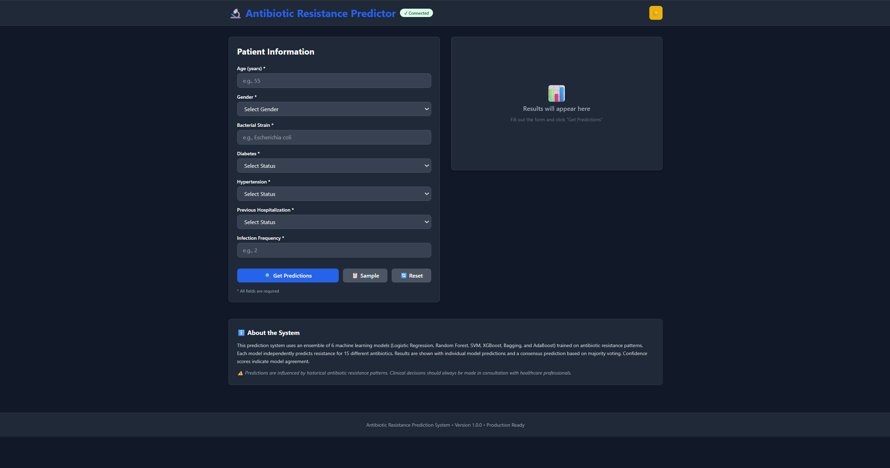
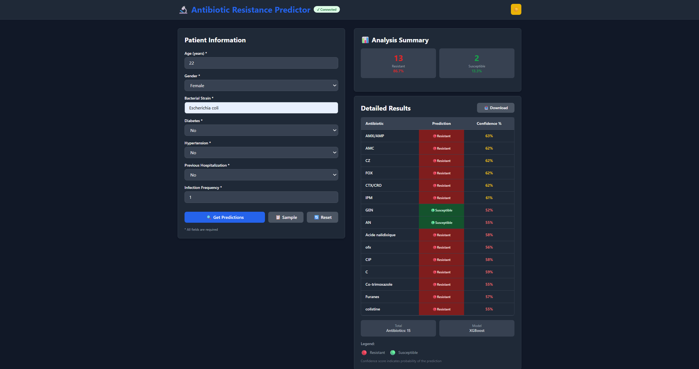

# Antibiotic Resistance Prediction System

A machine learning-based web application that predicts antibiotic resistance patterns for bacterial infections using a single XGBoost multi-output model optimized with per-antibiotic thresholds.

## 🎯 Overview

- **Model**: XGBoost Multi-Output Classifier
- **Target**: 15 antibiotics
- **Input**: Patient data (age, gender, bacterial strain, comorbidities, infection frequency)
- **Output**: Resistance prediction + confidence score for each antibiotic
- **Architecture**: FastAPI backend + React Vite frontend

## 📸 Screenshots

### Patient Input Form

*Left: Patient input form with 7 fields and dark mode toggle*

### Prediction Results

*Right: Results table showing antibiotic predictions with confidence scores and analysis summary*

## 📋 Project Structure

```
.
├── Backend/                 # FastAPI application
│   ├── main.py             # API routes and endpoints
│   ├── model_loader.py     # Model loading & caching
│   ├── utils.py            # Prediction logic
│   ├── schemas.py          # Pydantic models (request/response)
│   ├── config.py           # Configuration settings
│   ├── model_small.joblib  # Trained XGBoost model
│   └── requirements.txt    # Python dependencies
│
├── Frontend/               # React Vite application
│   ├── src/
│   │   ├── App.jsx         # Main app component
│   │   ├── components/     # React components
│   │   └── index.css       # Styling (Tailwind)
│   └── package.json        # Node dependencies
│
└── Model/                  # Jupyter notebooks & training data
```

## 🚀 Quick Start

### Prerequisites
- Python 3.9+ 
- Node.js 16+

### Backend Setup

```bash
cd Backend
python -m venv venv
venv\Scripts\activate          # Windows
source venv/bin/activate       # macOS/Linux

pip install -r requirements.txt

# Start API server
python main.py
# Server runs on http://127.0.0.1:8000
```

### Frontend Setup

```bash
cd Frontend
npm install
npm run dev
# App runs on http://127.0.0.1:5173
```

## 📊 Model Details

**File**: `Backend/model_small.joblib`

**Contents**:
```python
{
    "preprocessor": <sklearn.preprocessing.Pipeline>,
    "model": <xgboost.XGBMultiOutput>,
    "thresholds": [0.42, 0.55, 0.48, ...]  # 15 thresholds (one per antibiotic)
}
```

**Antibiotics** (15 total):
AMX/AMP, AMC, CZ, FOX, CTX/CRO, IPM, GEN, AN, Acide nalidixique, ofx, CIP, C, Co-trimoxazole, Furanes, colistine

## 🔌 API Endpoints

### Health Check
```
GET /api/v1/health
```
Response: Model loaded status, environment, version

### Predict
```
POST /api/v1/predict
```

**Request**:
```json
{
  "Age": 45.5,
  "Gender": "M",
  "Souches": "Escherichia coli",
  "Diabetes": "Yes",
  "Hypertension": "No",
  "Hospital_before": "Yes",
  "Infection_Freq": 2
}
```

**Response**:
```json
{
  "status": "success",
  "data": [
    {
      "antibiotic": "AMX/AMP",
      "prediction": "Resistant",
      "confidence": 82.5
    },
    ...
  ],
  "summary": {
    "total_antibiotics": 15,
    "resistant_count": 7,
    "susceptible_count": 8,
    "resistant_percentage": 46.7,
    "susceptible_percentage": 53.3,
    "recommended_antibiotics": ["AMC", "CIP", "CZ"]
  },
  "timestamp": "2026-04-11T12:08:14.852Z"
}
```

### API Info
```
GET /api/v1/info
```
Returns: Model type, available antibiotics, input field descriptions

## ⚙️ Configuration

Edit `Backend/.env`:
```
ENVIRONMENT=development
MODEL_PATH=model_small.joblib
FRONTEND_URL=http://127.0.0.1:5173
LOG_LEVEL=INFO
```

## 🎨 Frontend Features

- **Dark/Light Mode**: Toggle theme
- **Real-time Health Check**: API connectivity status
- **Patient Input Form**: 7 input fields with validation
- **Results Table**: Antibiotic predictions with confidence scores
- **Summary Card**: Resistant/susceptible counts + recommendations
- **Download Results**: Export predictions as JSON
- **Responsive Design**: Works on desktop and mobile

## 📈 Prediction Logic

For each antibiotic:
1. Preprocess patient data using fitted preprocessor
2. Get probability from XGBoost estimator: `predict_proba()[0][1]`
3. Apply threshold: `prediction = prob >= threshold`
4. Confidence = probability × 100

## 🛠️ Development

### Backend Tests
```bash
cd Backend
python test.py
```

### Logs
- Backend logs: `Backend/logs/app.log`
- Console output shows startup/prediction info

## 📝 Important Notes

⚠️ **Clinical Disclaimer**: Predictions are based on historical resistance patterns. Always consult healthcare professionals for clinical decisions.

⚠️ **Model Accuracy**: Evaluate model performance on your specific dataset before deployment.

## 🔄 Docker Deployment

```bash
docker-compose up
```
