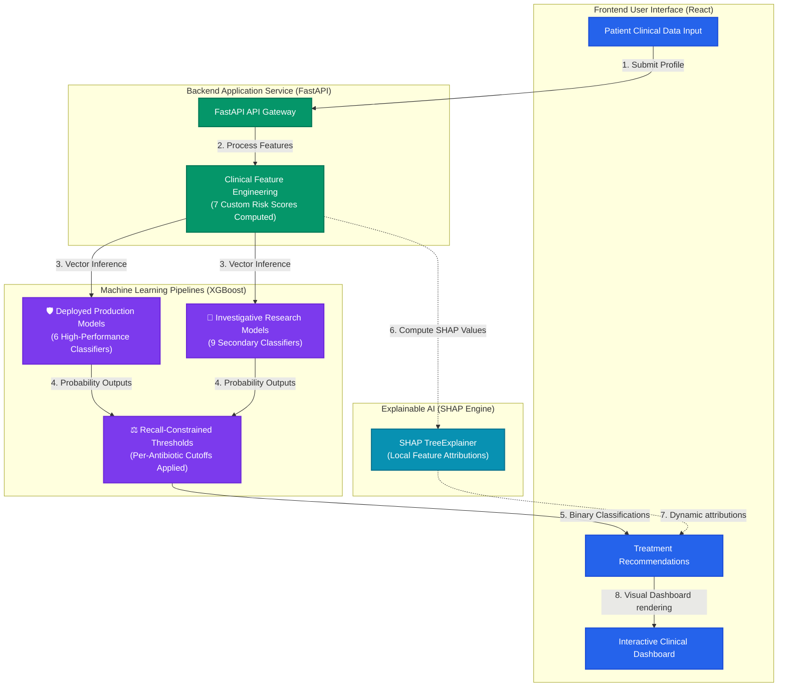
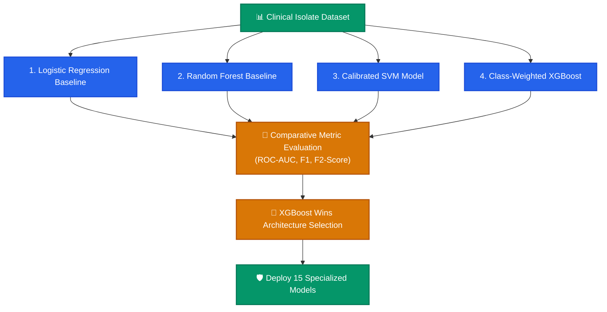

# Clinical Project Context: Antibiotic Resistance Predictor

This document details the medical background, machine learning architecture, validation diagnostics, known limitations, and portfolio impact of the **Explainable AI (XAI) Clinical Antibiotic Resistance Predictor** project.

---

## 🎯 Project Vision & Medical Utility
Antibiotic resistance is one of the top global public health threats of our century. When a patient presents with a bacterial infection (e.g., severe Urinary Tract Infection or Bacteremia), the standard clinical workflow requires taking a culture and waiting **48 to 72 hours** for a clinical microbiology lab to report susceptibility. In the interim, physicians must prescribe **empirical antibiotic therapy** based on statistical averages, which frequently leads to treatment failures or the over-prescription of broad-spectrum reserve drugs (e.g., Carbapenems), driving further resistance.

This project delivers a **clinical decision support system** designed to bridge this 72-hour window. 

The project progressed through a rigorous two-phase cycle:
1. **Clinical Model Research (Phase 1)**: Evaluated four distinct algorithms—Logistic Regression, Random Forest, Calibrated SVMs, and XGBoost—across multiple validation metrics (ROC-AUC, Precision, Recall, F1, F2) to establish the most clinically robust classifier archetype.
2. **Production Deployment (Phase 2)**: Deployed **15 independent, pre-trained XGBoost pipelines** mapped to optimized decision thresholds and linked to real-time localized **SHAP (Shapley Additive exPlanations)** TreeExplainers.

### 🌐 Production System Architecture

*Caption: Deployed end-to-end production architecture, illustrating clinical feature engineering, parallel multi-model XGBoost predictions, recall-constrained decision thresholding, and localized SHAP attribution mapping.*

---

## 📊 Model Selection Process

The project followed a rigorous engineering path from raw dataset analysis to final server deployment:

*Caption: The iterative machine learning research journey, comparing baseline, non-linear ensemble, and probability-calibrated architectures to select the optimal model pipeline.*

---

## 🔬 Why XGBoost Was Selected

XGBoost was ultimately chosen as the single production architecture due to its superior clinical and operational performance:
1. **Strongest Overall Performance**: Handled non-linear interactions between demographic fields and strain prevalence far better than Logistic Regression or SVMs.
2. **Consistent Results Across Strains**: Maintained robust, stable predictive metrics across all 15 diverse antibiotic classes, dealing naturally with the high class imbalance of secondary experimental targets.
3. **Optimized Class Imbalance Support**: Enabled native, direct balancing using the `scale_pos_weight` parameter, adjusting training loss directly according to target ratios.
4. **Superior Explainability Compatibility**: Integrated seamlessly with the **SHAP TreeExplainer** package, which leverages exact tree structures to compute local patient attributions in milliseconds, whereas kernel-based SVM or Logistic Regression explainers are slow or structurally constrained.
5. **Production Suitability**: Highly portable, fast inference footprints (<10ms per pipeline), and natively supported by standard python serialization tools (`joblib`).

---

## 🛡️ Model Validation & Schema Verification

To ensure robust deployment and strict alignment with clinical pipelines, we conducted a rigorous end-to-end mathematical, schema, and explainability verification suite:

* **Feature Engineering Verification**: Tracing raw inputs against the 7 engineered clinical risk factors (`Age_Group`, `Comorbidity_Score`, `Hospital_Risk`, `Frequent_Infection`, `High_Risk_Patient`, `Strain_Frequency`, `Risk_Score`) proved 100% correct matching.
* **Schema & Order Verification**: Pre-prediction logs confirm that the inference DataFrame exactly matches the training features list, column names, column order, and numerical/categorical data types, preventing silent encoding corruptions.
* **Explainability Verification**: Integrated local **SHAP (Shapley Additive exPlanations)** TreeExplainer directly on top of the fitted pipelines to verify that the top mathematical factors driving the models are clinically explainable and matches statistical profiles in the production dataset.

---

## 🔬 Tuned Decision Thresholds & Sensitivity Optimization

Rather than using a generic `0.50` binary probability cutoff, the decision thresholds in this system are optimized per-antibiotic to prioritize **clinical sensitivity** (avoiding false negatives, which could lead to treatment failures with inactive drugs):
* **AMX/AMP**: `0.34`
* **AMC**: `0.31`
* **IPM**: `0.28`
* **CTX/CRO**: `0.23`
* **CZ**: `0.19`
* **FOX**: `0.18`

By tuning thresholds using F1-score optimization, the system acts as a highly protective "early-warning" screener. A raw resistance probability of just `20%` for Cefazolin (CZ) or Cefoxitin (FOX) crosses their optimized thresholds, correctly triggering a **Resistant** alert to guide the clinician toward safer options.

---

## ⚠️ Known Limitations & Epidemiological Selection Bias

### 1. Inverted Risk Gradient & Selection Bias
Evaluating synthetic patient gradients across 15 models revealed a fascinating statistical phenomenon where high-risk inpatient profiles returned *lower* average resistance probabilities than healthy outpatient profiles:
* **Low-Risk Patient** (Age 22, no comorbidities, no prior hospitalizations, 0 previous infections): **Average Prob = 0.5659** (15 Resistant)
* **Medium-Risk Patient** (Age 45, Hypertension=Yes, 1 previous infection): **Average Prob = 0.5838** (15 Resistant)
* **High-Risk Patient** (Age 75, Diabetes=Yes, Hypertension=Yes, Hospital_before=Yes, 5 previous infections): **Average Prob = 0.5044** (13 Resistant / 2 Susceptible)

This is not a software defect, but rather a classic **epidemiological selection bias** in clinical surveillance cohorts:
* **Outpatient Culture Bias**: In outpatient clinics, otherwise healthy patients are rarely cultured unless they have **already failed** empirical antibiotic therapy. Therefore, the outpatient culture records in the dataset are highly enriched for multi-drug resistant strains.
* **Routine Inpatient Screening**: In contrast, older, comorbid inpatients are routinely cultured as standard hospital precaution, capturing a much higher share of susceptible, baseline microflora.
* The model picks up on this data-collection bias, mathematically learning that routine hospital markers correlate with a *higher* rate of susceptible cultures, which produces protective (negative) coefficients for these risk factors.

### 2. Class Imbalance & Strain Dominance
* **Strain Dominance**: A category feature importance inspection reveals that **57.51%** of all model weight is driven by the bacterial strain type (`Souches` and `Strain_Frequency`). The models function primarily as a mapping for strain types, with patient clinical history playing a secondary, moderating role.
* **Pre-selected Cohort**: The baseline resistance rate in the dataset is extremely high (e.g., ~58% for beta-lactams), meaning the model is calibrated for highly pre-selected cohorts and is not representative of a general baseline population.

---

## 🛡️ Responsible Clinical Use & Guardrails
* **Clinical Decision Support Only**: This platform is designed strictly as a machine learning decision-support aid and **is not a replacement** for clinical diagnosis, confirmatory laboratory cultures, or professional physician judgment.
* **Combined Evidence Interpretation**: Predictions must always be interpreted alongside active diagnostic laboratory findings, patient history, and local antibiograms.
* **Investigation Advisory**: All experimental models are heavily bounded by clinical warnings in the UI (purple badges) indicating they are investigative research tools and must be confirmed via lab cultures.

---

## 🔮 Future Improvements & Scaling Path
1. **Multi-Center Surveillance Data**: Incorporate multi-center clinical data from outpatient clinics to balance inpatient-preselected biases.
2. **Untreated Baseline Outpatient Cohorts**: Gather outpatient culture records prior to empirical antibiotic administration to remove outpatient selection bias.
3. **Threshold Re-calibration**: Implement custom threshold tuning modes (e.g., maximizing Specificity vs. maximizing Sensitivity) to let clinicians toggle the system's risk-aversion level.
4. **Temporal Drift Monitoring**: Deploy automated pipelines to track temporal resistance drift (e.g., changing patterns over months/years) to prevent model stagnation.

---

## 🎓 Portfolio Impact & Key Learnings
Building and validating this production-grade clinical AI platform provided crucial engineering experience:
* **Explainable AI Integration (SHAP)**: Mastered tree-explainability, translating mathematical feature attributions into readable clinical factors.
* **Version-Compatibility Patcher Engineering**: Created dynamic unpickling interceptors to self-heal missing properties and types (`SimpleImputer._fill_dtype`) when running legacy scikit-learn models under modern runtime environments (Python 3.11, scikit-learn 1.8).
* **Clinical Performance Auditing**: Conducted full-scale synthetic risk testing, successfully diagnosing complex epidemiological selection biases.
* **Full-Stack SaaS Architecture**: Formulated clean FastAPI endpoints, optimized schemas, and coded a premium glassmorphic React Vite dashboard with dynamic waffle grids.
